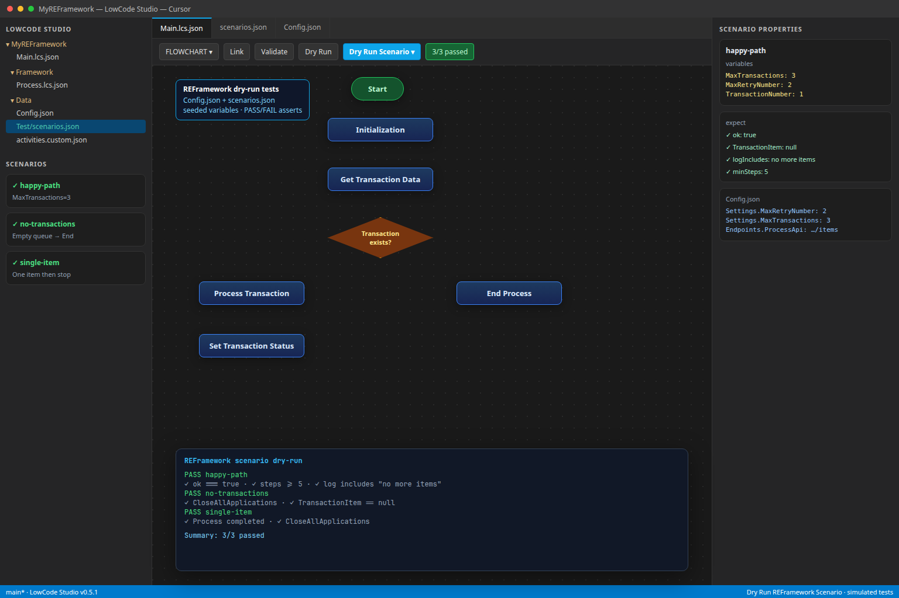
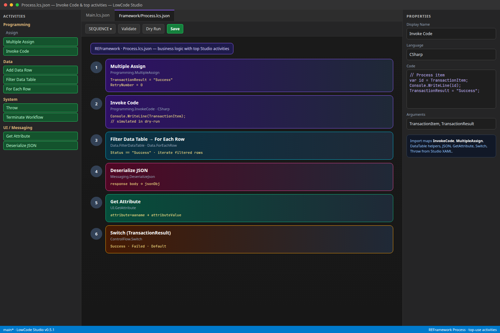

# LowCode Studio for VS Code / Cursor

**v0.6.0** — Mac-first low-code RPA: **dry-run scenarios** locally, **Connect to Studio Web** to publish.

**Repo:** https://github.com/nikosrokos/lowcode-studio

Full docs: [`lowcode-studio/README.md`](lowcode-studio/README.md) · Studio Web: [`lowcode-studio/docs/STUDIO_WEB.md`](lowcode-studio/docs/STUDIO_WEB.md)

## Easy loop

```
REFramework design → Shift+F5 scenarios → Connect to Studio Web → publish
```

## In action






## Install

```bash
cd lowcode-studio
npm install
npm run compile
npm test
npm run package
```

**Extensions: Install from VSIX…** → `lowcode-studio-0.6.0.vsix`

## Highlights in 0.6.0

- **Connect to Studio Web** — guided Portable export + checklist + open studio.uipath.com
- **Dry Run Scenarios** — Shift+F5, Manage Scenarios, last-scenario recall
- Config.xlsx bridge, Invoke Code / top activities, custom activities, Python pack
