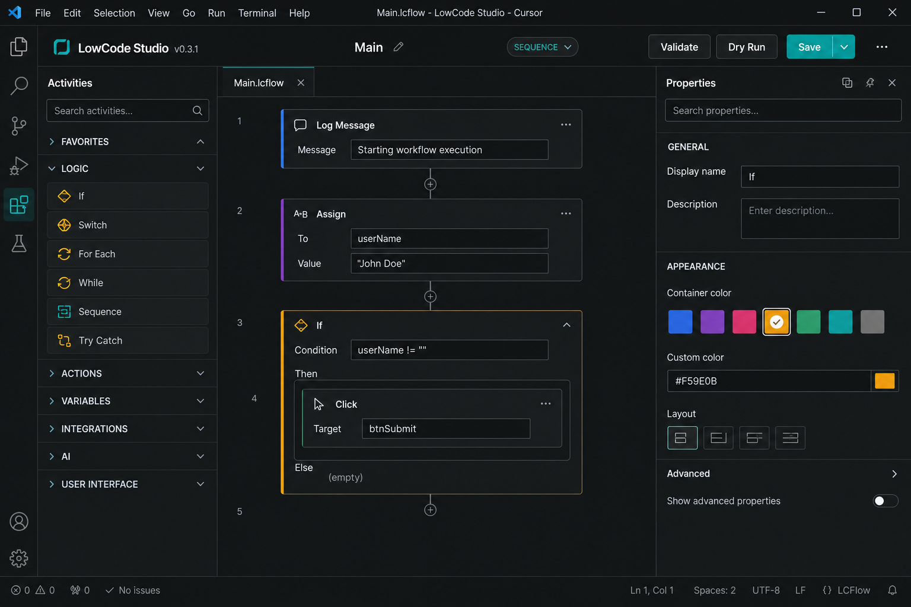
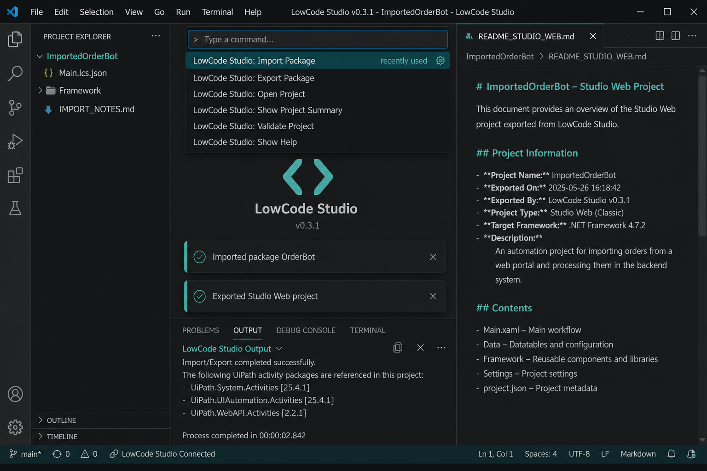
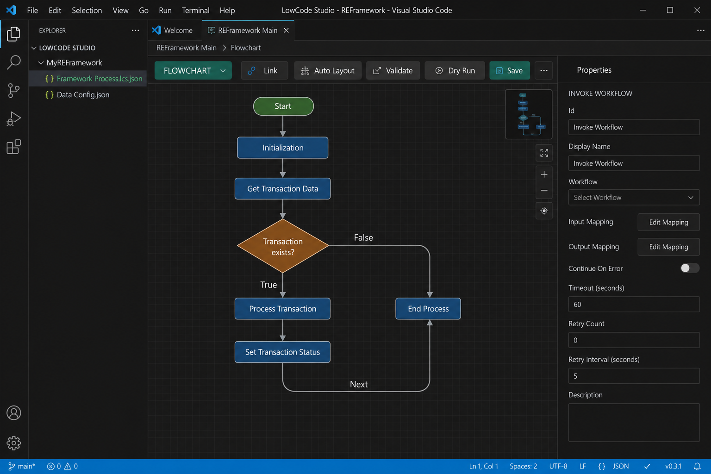

# LowCode Studio

**Version 0.5.0** · Studio-like **low-code RPA designer** for VS Code and Cursor on **Mac**, Windows, and Linux.

Built for UiPath practitioners who design, framework, develop, deploy, and test automations, but cannot run UiPath Studio Desktop on macOS. UiPath’s official **Maestro** extension covers Maestro Flows (`.flow`). This extension covers classic **Studio workflows**, **Flowcharts**, and **REFramework** locally in your editor — with import/export paths to Studio Web.

> Not an official UiPath product.


**Full activity list:** [docs/ACTIVITIES.md](docs/ACTIVITIES.md)

## In action (v0.5.0)

### 1. Sequence designer + custom container colors



### 2. Import UiPath / Export for Studio Web (with activity packages)



### 3. REFramework flowchart



## What’s in 0.5.0

- Visual **Sequence** + **Flowchart** designer (`.lcs.json`)
- **Custom container colors** per activity
- One-click **REFramework** template with **scenario dry-runs** (`Data/Test/scenarios.json`)
- **Register Custom Activity** — project (`activities.custom.json`) or user library
- **Import** UiPath project folders / `.nupkg` (XAML → `.lcs.json`)
- **Richer XAML coverage** — Excel, Mail, MessageBox, WriteLine, DoWhile, RetryScope, Check/Hover/SelectItem/Screenshot, Use Application/Browser
- **Python pack** — `UiPath.Python.Activities` style: Python Scope, Load/Run Script, Invoke Method, Get Object
- **Selector round-trip** — classic + modern encodings
- **Export for Studio Web** with activity package dependencies (includes custom NuGet packages when registered)
- Activity coverage catalog: [docs/ACTIVITIES.md](docs/ACTIVITIES.md)
- Dry Run simulator (F5) + **Dry Run REFramework Scenario**
- Works in VS Code, Cursor, and other forks

## Install

```bash
cd lowcode-studio
npm install
npm run compile
npm test
npm run package
```

In Cursor / VS Code: **Extensions: Install from VSIX…** → `lowcode-studio-0.5.0.vsix` → reload.

## Easy path (REFramework)

1. **LowCode Studio: New REFramework Project**
2. Open `Main.lcs.json` (flowchart)
3. Edit `Framework/Process.lcs.json` for business logic
4. Tune `Data/Config.json`
5. Press **F5** to dry-run Main, or run **Dry Run REFramework Scenario**

```
MyREFramework/
  Main.lcs.json
  Framework/
    InitAllSettings.lcs.json
    GetTransactionData.lcs.json
    Process.lcs.json
    SetTransactionStatus.lcs.json
    ...
  Data/
    Config.json
    Test/scenarios.json    ← simulated tests (variables + expects)
  activities.custom.json   ← project custom activities
```

### Simulated tests (Config + scenarios)

Yes — for REFramework on Mac, use **variables/config files + simulated scenarios**, not a robot:

| Piece | Purpose |
|---|---|
| `Data/Config.json` | Shared settings (`MaxTransactions`, retries, endpoints) |
| `Data/Test/scenarios.json` | Named dry-runs with seeded variables + assertions |
| **Dry Run REFramework Scenario** | Pick a scenario (or All) and see PASS/FAIL in Output |

### Custom activities

**Register Custom Activity** → choose **This project** (`activities.custom.json`, team-shared) or **All my projects** (user library on this machine). They appear in the Activities toolbox, get dry-run stubs, and contribute NuGet package refs on Studio Web export.

## Import → design on Mac → Studio Web

| Step | Command |
|---|---|
| Import Studio folder | **Import UiPath Project Folder** |
| Import package | **Import UiPath Package (.nupkg)** *(needs Include Sources)* |
| Export | **Export for Studio Web** |
| Open cloud designer | **Open Studio Web** → import the `*.StudioWeb` folder |
| Publish | Publish from Studio Web to Orchestrator |

Exported `project.json` includes packages such as `UiPath.System.Activities`, `UiPath.UIAutomation.Activities`, and Mail/WebAPI when used — so Studio can restore dependencies and avoid missing-package errors.

## Custom colors

Select an activity → **Container color** (presets, picker, or `#RRGGBB`). Saved on each node in `.lcs.json`.

## Activity catalog

| Category | Activities |
|---|---|
| System | Log Message, Delay, Comment, Message Box, Write Line |
| Programming | Assign |
| Control Flow | If, While, Do While, For Each, Try Catch, Sequence, Retry Scope, Break |
| UI Automation | Open Application, Click, Type Into, Get Text, Element Exists, Check, Hover, Select Item, Take Screenshot |
| Data | Read CSV, Write CSV, Build Data Table |
| Excel | Read Range, Write Range, Read Cell, Write Cell |
| Python | Python Scope, Load Python Script, Run Python Script, Invoke Python Method, Get Python Object |
| Messaging | Send Email, HTTP Request |
| Flowchart | Start, Flow Decision, End |
| REFramework | Invoke Workflow, Set Transaction Status |

See the full property-level list in [docs/ACTIVITIES.md](docs/ACTIVITIES.md).

UI/messaging steps are design + dry-run stubs on Mac (no local robot runtime).

## Commands

| Command | Shortcut |
|---|---|
| New Project / New REFramework Project | — |
| Import UiPath Project Folder / Package | — |
| Export for Studio Web / Open Studio Web | — |
| New Workflow | Cmd+Alt+N |
| Validate Workflow | Cmd+Shift+V |
| Dry Run | F5 |
| Dry Run REFramework Scenario | — |
| Register / Manage Custom Activities | — |
| Getting Started | — |

## Roadmap — next steps

### Done
- Richer XAML activity coverage (Excel, Mail, modern UI, RetryScope, …)
- Selector round-trip (classic + modern encodings)
- **Python activities** (`UiPath.Python.Activities` pack) + **ACTIVITIES.md** coverage catalog
- **Custom activity registration** (project + user) + **REFramework scenario dry-runs**

### Near term
1. **Import polish** — clearer placeholder UI for `Imported.*` activities + one-click “replace with…”
2. **Git-friendly Studio Web sync docs** — short guide for tenants using Git with Studio Web
3. **Config.xlsx bridge** — optional convert/export for classic REFramework Excel config

### Next
4. **Validation against Studio packages** — warn when an activity needs a package not listed in dependencies
5. **Deeper modern UI** — Use Application/Browser scope variables, anchors, CV activities (best-effort)
6. **Marketplace publish** of the VSIX

### Later (only if needed)
7. Optional Orchestrator API publish from VS Code (today: publish stays in Studio Web — by design)
8. Selector recorder helpers for Mac
9. Optional real local Python runner for dry-run (today: simulated handlers only)

## License

MIT
