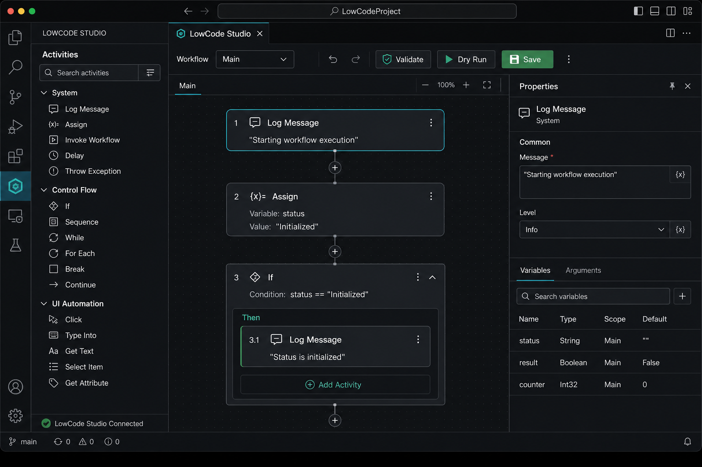
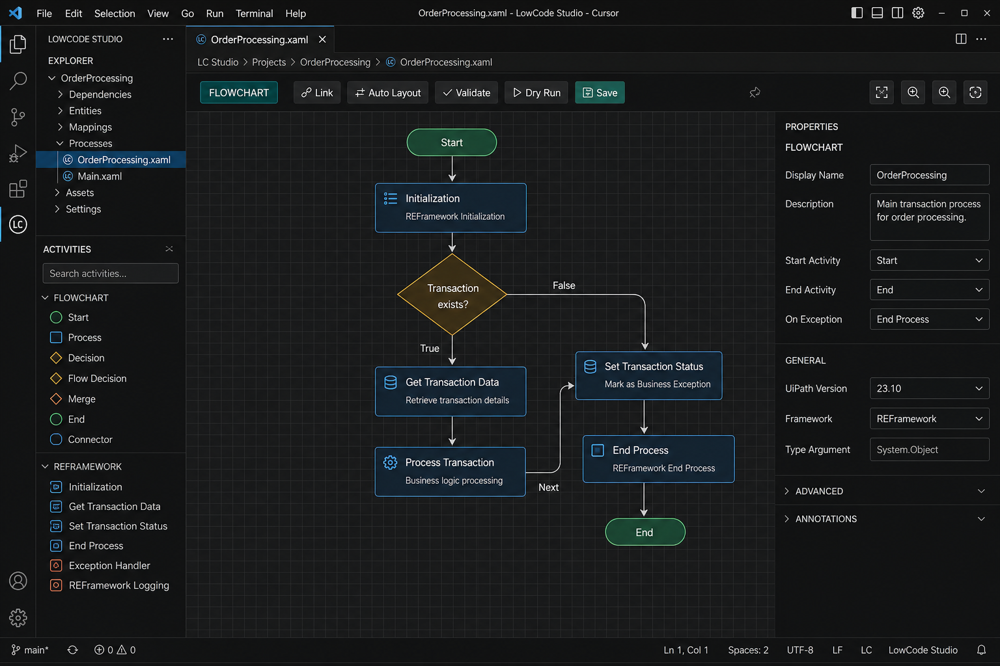
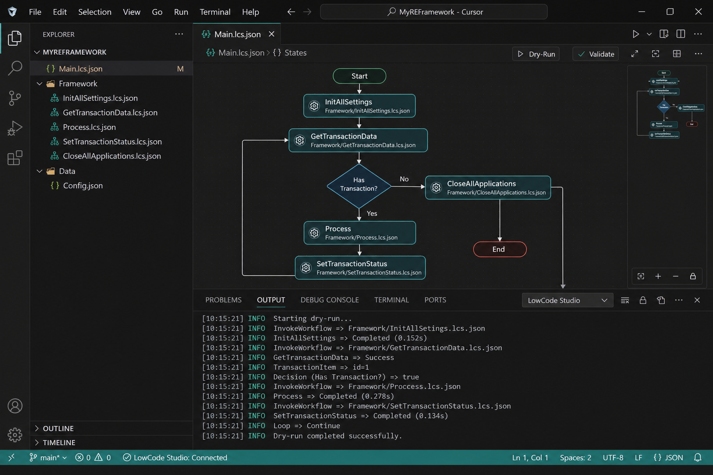

# LowCode Studio

Studio-like **low-code RPA designer** for VS Code and Cursor — works on **Mac**, Windows, and Linux.

Built for UiPath practitioners who design, framework, develop, deploy, and test automations, but cannot run UiPath Studio Desktop on macOS. UiPath’s official **Maestro** extension covers Maestro Flows (`.flow` orchestration). This extension covers classic **Studio workflows**, **Flowcharts**, and **REFramework** locally in your editor.

> Not an official UiPath product.

## In action

### Sequence designer



### Flowchart mode



### REFramework project + dry run



## Features

- Visual **Sequence** designer for `.lcs.json`
- Visual **Flowchart** mode — free-form canvas, ports, True/False/Next links, auto-layout
- One-click **REFramework** template (Init → Get Data → Process → End)
- Activity toolbox: System, Control Flow, UI, Data, Messaging, Flowchart, REFramework
- Properties panel + Variables manager + Project Explorer
- Validate + Dry Run simulator (F5), including flowchart transaction loops
- Export to pseudocode
- Works in VS Code, Cursor, and other VS Code forks

## Install (Mac / Cursor / VS Code)

### From VSIX

```bash
cd lowcode-studio
npm install
npm run compile
npm run package
```

Then in Cursor / VS Code:

1. Command Palette → **Extensions: Install from VSIX…**
2. Select the generated `lowcode-studio-0.2.0.vsix`
3. Reload the window

### Develop

```bash
cd lowcode-studio
npm install
npm run compile
npm test
```

Open the `lowcode-studio` folder and press **F5** (Extension Development Host).

## Easy REFramework (recommended)

1. Open a workspace folder
2. Command Palette → **LowCode Studio: New REFramework Project**
3. Open `Main.lcs.json` — flowchart of framework states
4. Put business logic in `Framework/Process.lcs.json`
5. Tune retries / endpoints in `Data/Config.json`
6. Press **F5** on Main to dry-run the transaction loop

```
MyREFramework/
  Main.lcs.json
  Framework/
    InitAllSettings.lcs.json
    InitAllApplications.lcs.json
    GetTransactionData.lcs.json
    Process.lcs.json
    SetTransactionStatus.lcs.json
    CloseAllApplications.lcs.json
    ...
  Data/
    Config.json
    Input/ Output/ Temp/
```

## Flowchart mode

- Create a blank project and choose **Flowchart**, or open `samples/FlowchartDemo.lcs.json`
- Drop activities on the grid and drag nodes to position them
- Drag the blue **port** to another node to create a link
- Label decision edges `True` / `False` (Connections panel)
- **Auto Layout** arranges nodes by graph depth
- Dry Run follows connections from the Start node

## Quick start (blank)

1. **LowCode Studio: New Project** → Blank → Sequence or Flowchart
2. Drag activities, edit properties
3. **F5** Dry Run

Samples:

- `samples/HelloWorld.lcs.json`
- `samples/FlowchartDemo.lcs.json`

## Activity catalog (v0.2)

| Category | Activities |
|---|---|
| System | Log Message, Delay, Comment |
| Programming | Assign |
| Control Flow | If, While, For Each, Try Catch, Sequence |
| UI Automation | Open Application, Click, Type Into, Get Text, Element Exists |
| Data | Read CSV, Write CSV, Build Data Table |
| Messaging | Send Email, HTTP Request |
| Flowchart | Start, Flow Decision, End |
| REFramework | Invoke Workflow, Set Transaction Status |

UI/messaging activities are **design + dry-run stubs** on Mac (no local robot runtime).

## Commands

| Command | Shortcut |
|---|---|
| New Project | — |
| New REFramework Project | — |
| New Workflow | Cmd+Alt+N |
| Validate Workflow | Cmd+Shift+V |
| Dry Run | F5 |
| Export Pseudocode | — |
| Getting Started | — |

## How this relates to UiPath Maestro

| | UiPath Maestro (official) | LowCode Studio (this) |
|---|---|---|
| Focus | Maestro Flows / orchestration | Classic Studio + REFramework low-code |
| File type | `.flow` | `.lcs.json` |
| Mac support | Yes (VS Code) | Yes (VS Code / Cursor) |
| Cloud deploy | Orchestrator via `uip` CLI | Local design + dry-run (extensible) |

## Roadmap ideas

- Selector recorder helpers
- Import/export bridges toward Studio Web / XAML-inspired interchange
- Real runner adapters (CLI / Orchestrator hooks)

## License

MIT
