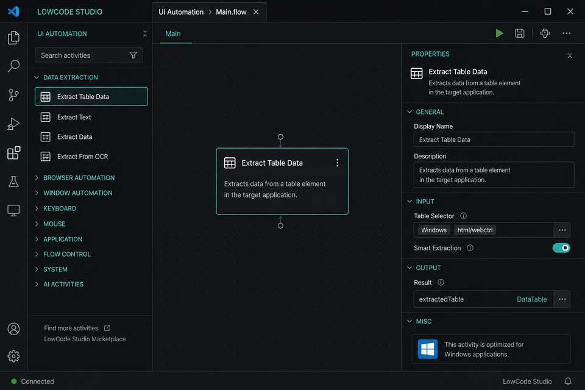

# LowCode Studio

**Version 0.6.5** · Studio-like **low-code RPA designer** for VS Code and Cursor on **Mac**, Windows, and Linux.

Built for UiPath practitioners who design, framework, develop, deploy, and test automations, but cannot run UiPath Studio Desktop on macOS. UiPath’s official **Maestro** extension covers Maestro Flows (`.flow`). This extension covers classic **Studio workflows**, **Flowcharts**, and **REFramework** locally — with the easiest path to **Studio Web** publish.

> Not an official UiPath product.


**Full activity list:** [docs/ACTIVITIES.md](docs/ACTIVITIES.md) · **Studio Web guide:** [docs/STUDIO_WEB.md](docs/STUDIO_WEB.md)

## The easy loop (what this extension is for)

```
Design on Mac (REFramework)
   → Dry Run / Scenarios   (F5 / Shift+F5)
   → Connect to Studio Web (Cmd+Shift+U)
   → Import at studio.uipath.com
   → Publish to Orchestrator
```

| Priority | What | Shortcut |
|---|---|---|
| **1. Test** | Dry Run + **Manage Scenarios** | F5 / **Shift+F5** / Cmd+Shift+T |
| **2. Ship** | **Connect to Studio Web** | **Cmd+Shift+U** |
| Design | New REFramework / Designer | — |
| Config | Config.json ↔ Config.xlsx | — |

## In action

<p>
  
</p>

<p>
  
  &nbsp;
  
</p>

1. **Designer** — sequence canvas, activities toolbox, floating/resizable properties  
2. **Project Explorer** — title actions with tooltips (Open, Scenarios, Connect, Validate…)  
3. **Extract Table Data** — smart page → DataTable extraction for Windows UI automation

## What’s in 0.6.5

- **Selector Builder** in the designer — templates + fields for classic `<html>/<webctrl>` / `<wnd>` selectors (Mac-friendly)
- **Use Application/Browser** modern UI scope — nest Click / Type Into / Extract Table under an app/browser card
- **Windows TODO checklist** on Connect to Studio Web — `WINDOWS_TODO.md` + Output report for handoff items

### Also in 0.6.4

- Project Explorer title actions with **tooltips** (`title` / `shortTitle`)
- Properties panel can **float**, **resize** (width/height), or **collapse**
- **Extract Table Data** activity — smart table extraction from page to DataTable
- README screenshots refreshed (3 compact current-UI images)

### Also in 0.6.3

- **Windows project target** — Connect/Export writes `targetFramework: Windows` (`net8.0-windows`) so automations run on Windows robots
- **Windows classic selectors** — UI activities default to `<html>/<webctrl>` (and normalize `<target>` placeholders on export)
- Package validation warns on missing / placeholder selectors

### Also in 0.6.2

- **Variables panel collapsed** by default in the designer (expand when needed)
- **Package validation warnings** — Validate Packages + pre-check on Connect to Studio Web
- **Project Explorer title actions** — Open Local Project · Scenarios · Connect · Validate · Refresh (create/import in `…` menu)
- **Open Local Project** — browse to a folder with `project.json` and open the main workflow

### Also in 0.6.1

- **Studio Web packages** — Connect exports **`.uip`** (Import project) + **`.uis`** (solution/CLI)
- **Project Explorer** grouped by folders (Framework, Data, …)
- **Invoke Workflow** opens the target workflow in a new designer tab
- Designer UX: expand/collapse on Activities + Properties (grouped categories), canvas zoom, friendlier grid, hover highlight + tooltips

### Also in 0.6.0

- **Connect to Studio Web** — guided export + checklist + open studio.uipath.com ([guide](docs/STUDIO_WEB.md))
- **Dry Run Scenarios** as a first-class path — Shift+F5, last-scenario recall, Manage Scenarios
- Config.xlsx bridge, custom activities, Invoke Code + top-use activities, Python pack, XAML import/export
- Activity catalog: [docs/ACTIVITIES.md](docs/ACTIVITIES.md)

## Install

```bash
cd lowcode-studio
npm install
npm run compile
npm test
npm run package
```

In Cursor / VS Code: **Extensions: Install from VSIX…** → `lowcode-studio-0.6.5.vsix` → reload.

## Easy path (REFramework)

1. **Open Local Project** (Project Explorer title) *or* **New REFramework Project**
2. Edit `Framework/Process.lcs.json`
3. Tune `Data/Config.json` (or import classic `Config.xlsx`)
4. **Shift+F5** → run scenarios (or **Manage Scenarios** to add a quick smoke test)
5. **Validate Packages** (optional) → **Connect to Studio Web** → **Reveal .uip** → Import in [studio.uipath.com](https://studio.uipath.com)

```
MyREFramework/
  Main.lcs.json
  Framework/Process.lcs.json
  Data/
    Config.json + Config.xlsx
    Test/scenarios.json      ← easiest local tests
  activities.custom.json
```

### Dry-run & scenarios (key feature)

| Piece | Purpose |
|---|---|
| **F5** | Dry-run the open workflow |
| **Shift+F5** | Pick scenario / All / Add quick / Manage |
| **Manage Scenarios** | Add MaxTransactions smoke tests, duplicate, open file |
| `Data/Test/scenarios.json` | Named seeds + PASS/FAIL expects |

Last scenario is remembered for one-click re-run.

### Connect to Studio Web (key feature)

| Step | Action |
|---|---|
| 1 | **Connect to Studio Web** (exports Windows `.uip` + `.uis`) |
| 2 | **Reveal .uip** / Open Checklist (`OPEN_IN_STUDIO_WEB.md`) |
| 3 | Import in Studio Web **or** open in Studio Desktop (Windows) |
| 4 | Refine selectors on Windows → publish → run on Windows robot |

Git tenants: commit the `*.StudioWeb` folder into the repo Studio Web tracks, then pull in Studio Web. Full notes: [docs/STUDIO_WEB.md](docs/STUDIO_WEB.md).

Export includes XAML, `project.json` (NuGet deps), Config.json/xlsx, and `scenarios.json` for handoff reference.

### Config.xlsx bridge

| Command | Direction |
|---|---|
| **Export Config.xlsx** | JSON → classic Settings / Constants / Assets |
| **Import Config.xlsx** | classic Excel → JSON |

### Custom activities

**Register Custom Activity** → This project (`activities.custom.json`) or All my projects (user library).

## Activity catalog (summary)

| Category | Highlights |
|---|---|
| Programming | Assign, Multiple Assign, **Invoke Code** |
| Data | Build/Filter/ForEach Row, Add Row/Column, CSV |
| System | Log, Throw, Terminate Workflow |
| UI | Use Application/Browser, Click, Type Into, Extract Table, … |
| Messaging | HTTP, Email, Deserialize/Serialize JSON |
| Python | Scope, Load/Run Script, Invoke Method, Get Object |
| REFramework | Invoke Workflow, Set Transaction Status |

See [docs/ACTIVITIES.md](docs/ACTIVITIES.md). Invoke Code / UI steps are dry-run stubs on Mac (real run in Studio/Robot).

## Commands

| Command | Shortcut |
|---|---|
| Dry Run | F5 |
| **Dry Run Scenarios** | **Shift+F5** |
| **Manage Scenarios** | Cmd+Shift+T |
| **Connect to Studio Web** | **Cmd+Shift+U** |
| Show Studio Web Guide | — |
| Export for Studio Web | — |
| Export / Import Config.xlsx | — |
| New REFramework Project | — |
| Getting Started | — |

## Roadmap

### Done
- Scenario dry-runs + Manage Scenarios UX
- **Connect to Studio Web** guided handoff + Git notes
- Config.xlsx bridge, custom activities, Invoke Code / top activities, Python pack
- Package validation warnings + Open Local Project + Project Explorer title actions
- Windows project target + classic Windows UI selectors for robot execution
- Floating/resizable properties panel, Extract Table Data, title-action tooltips
- Selector Builder, Use Application/Browser scope, Windows TODO on Connect

### Next
1. Import polish for `Imported.*` placeholders
2. Blueprints + Cmd+K activity palette
3. Marketplace publish

## License

MIT
