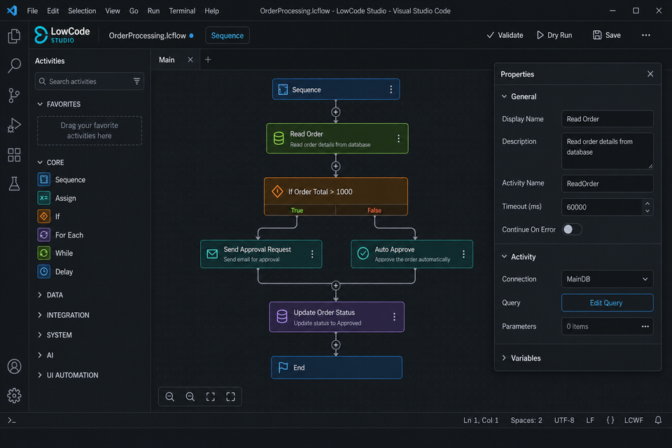
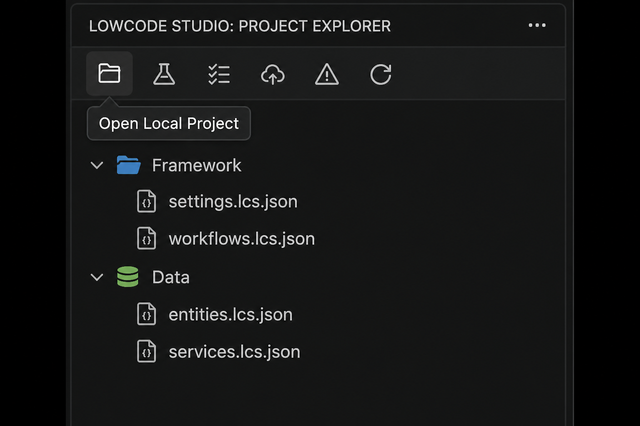

# LowCode Studio

**Version 0.6.24** · Studio-like **low-code RPA designer** for VS Code and Cursor on **Mac**, Windows, and Linux.

Built for UiPath practitioners who design, framework, develop, deploy, and test automations, but cannot run UiPath Studio Desktop on macOS. UiPath’s official **Maestro** extension covers Maestro Flows (`.flow`). This extension covers classic **Studio workflows**, **Flowcharts**, and **REFramework** locally — with the easiest path to **Studio Web** publish.

> Not an official UiPath product.


**Full activity list:** [docs/ACTIVITIES.md](docs/ACTIVITIES.md) · **Studio Web guide:** [docs/STUDIO_WEB.md](docs/STUDIO_WEB.md)

## The easy loop (what this extension is for)

```
Design on Mac (REFramework)
   → Dry Run / Scenarios   (F5 / Shift+F5)
   → Connect Local Workspace (Cmd+Shift+U)
   → Open folder in Studio Web → Local Workspace
   → Save in LCS (auto-sync) → Publish
```

| Priority | What | Shortcut |
|---|---|---|
| **1. Test** | Dry Run + **Manage Scenarios** | F5 / **Shift+F5** / Cmd+Shift+T |
| **2. Ship** | **Studio Web Local Workspace** (sync on Save) | **Cmd+Shift+U** |
| Design | **Insert (⌘K)** / Blueprint / REFramework | **⌘K** in designer |
| Config | Config.json ↔ Config.xlsx | — |

## In action

<p>
  
</p>

<p>
  
</p>

1. **Designer** — framed toolbox + properties, sequence board, macOS-style bottom dock  
2. **Floating frames** — traffic-light controls to float / dock / collapse either side panel  

## What’s in 0.6.24

- **Dry-run 2.0 (C1)**
  - Breakpoints on sequence cards / flowchart nodes; Continue stops at the next hit
  - **Run to here** (card ⏭ or playback bar) for step-through to a selected activity
  - **Watch** panel — editable mid-run variables; Re-run with watch seeds
  - **Fixtures** session editor (HTTP / UI / tables / queue / assets) applied on dry-run
  - Per-step labels: `real` · `simulated` · `unsupported` (Output + playback)
- **VS Code Output** — dry-run logs and button notifications (Saved, Validate, toasts) go to **LowCode Studio** Output

### Also in 0.6.23

- **Phase B activities** (no Testing pack)
  - Orchestrator: Get Transaction Item, Add Queue Item, Get/Set Asset; Set Transaction Status exports real XAML
  - Excel: Append Range, Excel Application Scope; DataTable Join / Lookup / Sort; Filter operators
  - Control: Parallel, Parallel For Each, Timeout Scope; Switch cases on export
  - Messaging: HTTP auth/headers/status, Get Email, Select Token (JSON path)
  - Blueprint: **Queue → Process → Set Status** with queue/asset fixtures

### Also in 0.6.22

- **Workflow Arguments** panel (In / Out / InOut) with XAML `x:Members` export/import
- **Invoke Workflow** argument mappings (`name = expression` → `InvokeWorkflowFile.Arguments`)
- Left rail: separate stacked **Explorer · Activities · Variables · Arguments** sections
- **Expression expand** editor for expression/multiline properties
- **Find in workflow** search + nested **breadcrumbs**
- Flowchart **Tidy** layout (layered spacing + orphan handling)
- Selector “needs real selector” hint on flowchart nodes

### Also in 0.6.21

- Dock chrome polish: **Save** top-right only; clearer bottom-dock tooltips
- Side panels: no red close — show/hide via bottom dock; float/dock traffic lights kept
- Expand/collapse actions use **▾▾ / ▸▸** symbols

### Also in 0.6.20

- **Maestro-inspired canvas chrome**
  - Framed, resizable left Toolbox and right Properties panels
  - macOS traffic lights: float · dock
  - Floating frames with drag + height resize; docked frames with width resize
  - Bottom-center dock (zoom, insert, validate, dry-run, step, panel toggles)
  - Slim top bar (brand · workflow · mode · Save)
- README screenshots refreshed (2 images)

### Also in 0.6.19

- **Selectors & UI automation**
  - Use Application/Browser imports as a real container (`NApplicationCard`) with nested Click/Type/GetText children
  - Get Text / Element Exists / Get Attribute export `Result=` + timeouts; GetText supports Input Method
  - Empty defaults (no fake “done” selectors); stronger placeholder detection; Selector Builder applies live
  - Mode-aware Use Application/Browser props (Browser vs Application); Modern Selector collapsed when empty
- **Canvas UX**
  - Sequence board surface, spine drop-zones, stronger selection, scroll fade, empty-state prompt
  - Cards warn when a required selector is still a starter

### Also in 0.6.18

- Skip **Manual Trigger** (and other Studio Web triggers) on import/export — no more Comment placeholders in Main.xaml
- Strip **`(imported)`** from DisplayName when writing XAML
- Fix LogMessage values: designer `12` exports as `["12"]` (not `[12]` / double-wrapped mess)

### Also in 0.6.17

- Fix Studio Web **`Failed to create a 'Level' from 'TraceLevel.Info'`** — LogMessage exports `Level="Info"` (Studio Web enum), not `TraceLevel.Info`
- Cleaner Open flow: pick **LCS project / Studio Web solution / Create Local Workspace**; quieter status-bar feedback; no auto-open Main after solution open/reload

### Also in 0.6.16

- Fix Studio Web open error **`'sapc' prefix is not defined`** — exported `.xaml` now uses `mc:Ignorable="sap sap2010"` with matching xmlns (like real UiPath files)
- Project Explorer: linked Studio Web solutions nest under the LCS project (no duplicate auto-added workspace root); Remove actually hides/unlinks stuck entries

### Also in 0.6.15

- **Save syncs .xaml reliably** — uses in-memory workflow (not a racing disk read), discovers all `.lcs.json` files, flushes designer state on Cmd+S, atomic writes so Studio Web Local Workspace notices changes
- Toast shows `Saved · synced .xaml → …` when linked (or reminds you to Connect if not)

### Also in 0.6.14

- **Open** accepts Studio Web Local Workspace solutions (`.uipx`) even when no workspace folder is open — no more “Open a workspace folder first”
- Opening a solution adds it to Project Explorer; optional Link & Sync to the active LCS project

### Also in 0.6.13

- Fix Studio Web parse error: `entryPoints[0].uniqueId` is now a real Guid (names like "RPA Workflow" previously broke open)
- Linked Studio Web solutions appear in Project Explorer; **Remove** / **Unlink** supported (designer × and context menu)

### Also in 0.6.12

- **Local Workspace uses Portable** — fixes Studio Web error that Windows projects can only open on a Windows machine / Studio Desktop
- Re-Connect or Save rewrites an already-linked project as Portable (`net8.0`)

### Also in 0.6.11

- **Studio Web Local Workspace** — create/open a `.uipx` solution folder; **Save** syncs `.xaml` (no routine `.uip` export)
- Designer **Project** tab shows folders/files of the **current** RPA project only
- Legacy one-off `.uip` export still available from the Connect picker

### Also in 0.6.10

- **Export .uip** creates only the `.uip` package (no `.uis`)
- Export uses the **selected / open project** — no more packing the wrong sibling project
- Designer left rail tabs: **Project** · **Activities** · **Variables** (Variables moved off the right Properties panel)

### Also in 0.6.9

- **Input Method** on UI activities (Click, Type Into, Hover, Check, Select Item, Use Application/Browser)
- Choose **Simulate**, **Chromium API**, **Window Messages**, **Hardware Events**, **Same as App/Browser**, or scope **Background** before Connect
- Exports as modern `InteractionMode` (`DebuggerApi` = Chromium API) on Studio Web XAML

### Also in 0.6.8

- **Cmd+K activity palette** in the designer — search Favorites / Recent / All; pin up to 10 favorites (★)
- Shortcuts: **⌘K** (in designer), **⌘⇧A**, or **⌘K ⌘I**; also **Insert** toolbar button
- **Smart property suggestions** — Config keys (`Config.Settings…`), variables, and Invoke workflow paths as chips + datalist

### Also in 0.6.7

- **Robot blueprints** — one-click scaffolds beyond REFramework:
  - Web scrape → Excel
  - Login → Extract table → Email
  - API → DataTable → Process
- Command **New Robot Blueprint** + Project Explorer create menu; each ships with scenarios/fixtures

### Also in 0.6.6

- **Stronger Mac dry-run** — UI/HTTP/table fixtures, per-step variable diffs, empty-selector warnings
- **Step Through** in the designer — highlight each activity, Step / Continue / Stop, Δ variables strip
- Scenario reports show **expected vs actual** (including DataTable side-by-side) when assertions fail

### Also in 0.6.5

- **Selector Builder** in the designer — templates + fields for classic `<html>/<webctrl>` / `<wnd>` selectors (Mac-friendly)
- **Use Application/Browser** modern UI scope — nest Click / Type Into / Extract Table under an app/browser card
- **Windows TODO checklist** on Connect to Studio Web — `WINDOWS_TODO.md` + Output report for handoff items

### Also in 0.6.4

- Project Explorer title actions with **tooltips** (`title` / `shortTitle`)
- Properties panel can **float**, **resize** (width/height), or **collapse**
- **Extract Table Data** activity — smart table extraction from page to DataTable
- README screenshots refreshed (3 compact current-UI images)

### Also in 0.6.3

- **Windows project target** — Connect/Export writes `targetFramework: Windows` (`net8.0-windows`) so automations run on Windows robots
- **Windows classic selectors** — UI activities default to `<html>/<webctrl>` (and normalize `<target>` placeholders on export)
- Package validation warns on missing / placeholder selectors

### Also in 0.6.2

- **Variables panel collapsed** by default in the designer (expand when needed)
- **Package validation warnings** — Validate Packages + pre-check on Connect to Studio Web
- **Project Explorer title actions** — Open Local Project · Scenarios · Connect · Validate · Refresh (create/import in `…` menu)
- **Open Local Project** — browse to an LCS `project.json` **or** a Studio Web `.uipx` solution folder

### Also in 0.6.1

- **Studio Web packages** — Connect / Export .uip writes **`.uip`** (Import project) only
- **Project Explorer** grouped by folders (Framework, Data, …)
- **Invoke Workflow** opens the target workflow in a new designer tab
- Designer UX: expand/collapse on Activities + Properties (grouped categories), canvas zoom, friendlier grid, hover highlight + tooltips

### Also in 0.6.0

- **Connect to Studio Web** — guided export + checklist + open studio.uipath.com ([guide](docs/STUDIO_WEB.md))
- **Dry Run Scenarios** as a first-class path — Shift+F5, last-scenario recall, Manage Scenarios
- Config.xlsx bridge, custom activities, Invoke Code + top-use activities, Python pack, XAML import/export
- Activity catalog: [docs/ACTIVITIES.md](docs/ACTIVITIES.md)

## Install

```bash
cd lowcode-studio
npm install
npm run compile
npm test
npm run package
```

In Cursor / VS Code: **Extensions: Install from VSIX…** → `lowcode-studio-0.6.24.vsix` → reload.

## Easy path

**Fastest start:** **New Robot Blueprint** → pick scrape→Excel / login→email / API→table → **F5**.

**REFramework path:**

1. **Open Local Project** (Project Explorer title) *or* **New REFramework Project**
2. Edit `Framework/Process.lcs.json`
3. Tune `Data/Config.json` (or import classic `Config.xlsx`)
4. **Shift+F5** → run scenarios (or **Manage Scenarios** to add a quick smoke test)
5. **Validate Packages** (optional) → **Connect / Open Studio Web Local Workspace** → open that folder in Studio Web Local Workspace → **Save** to sync

```
MyREFramework/
  Main.lcs.json
  Framework/Process.lcs.json
  Data/
    Config.json + Config.xlsx
    Test/scenarios.json      ← easiest local tests
  activities.custom.json
```

### Dry-run & scenarios (key feature)

| Piece | Purpose |
|---|---|
| **F5** | Dry-run the open workflow (Run All or Step Through) |
| **Step Through** | Designer button — highlight steps + variable deltas |
| **Shift+F5** | Pick scenario / All / Add quick / Manage |
| **Manage Scenarios** | Add MaxTransactions smoke tests, duplicate, open file |
| `Data/Test/scenarios.json` | Named seeds + PASS/FAIL expects |

Last scenario is remembered for one-click re-run.

### Studio Web Local Workspace (key feature)

| Step | Action |
|---|---|
| 1 | **Connect / Open Studio Web Local Workspace** (create or open a `.uipx` solution) |
| 2 | **Reveal Solution** → Studio Web → **Local Workspace** → Open solution → Allow |
| 3 | **Save** in LowCode Studio — `.xaml` syncs into the linked folder |
| 4 | Publish from Studio Web → run on a Windows robot |

Git tenants: commit the `*.StudioWeb` folder into the repo Studio Web tracks, then pull in Studio Web. Full notes: [docs/STUDIO_WEB.md](docs/STUDIO_WEB.md).

Export includes XAML, `project.json` (NuGet deps), Config.json/xlsx, and `scenarios.json` for handoff reference.

### Config.xlsx bridge

| Command | Direction |
|---|---|
| **Export Config.xlsx** | JSON → classic Settings / Constants / Assets |
| **Import Config.xlsx** | classic Excel → JSON |

### Custom activities

**Register Custom Activity** → This project (`activities.custom.json`) or All my projects (user library).

## Activity catalog (summary)

| Category | Highlights |
|---|---|
| Programming | Assign, Multiple Assign, **Invoke Code** |
| Data | Build/Filter/ForEach Row, Add Row/Column, CSV |
| System | Log, Throw, Terminate Workflow |
| UI | Use Application/Browser, Click, Type Into, Extract Table, … |
| Messaging | HTTP, Email, Deserialize/Serialize JSON |
| Python | Scope, Load/Run Script, Invoke Method, Get Object |
| REFramework | Invoke Workflow, Set Transaction Status |

See [docs/ACTIVITIES.md](docs/ACTIVITIES.md). Invoke Code / UI steps are dry-run stubs on Mac (real run in Studio/Robot).

## Commands

| Command | Shortcut |
|---|---|
| Dry Run | F5 |
| **Dry Run Scenarios** | **Shift+F5** |
| **Activity Palette** | **⌘K** (designer) / Cmd+Shift+A |
| **Manage Scenarios** | Cmd+Shift+T |
| **Connect to Studio Web** | **Cmd+Shift+U** |
| Show Studio Web Guide | — |
| Export for Studio Web | — |
| Export / Import Config.xlsx | — |
| **New Robot Blueprint** | — |
| New REFramework Project | — |
| Getting Started | — |

## Roadmap

### Done
- Scenario dry-runs + Manage Scenarios UX
- **Connect to Studio Web** guided handoff + Git notes
- Config.xlsx bridge, custom activities, Invoke Code / top activities, Python pack
- Package validation warnings + Open Local Project + Project Explorer title actions
- Windows project target + classic Windows UI selectors for robot execution
- Floating/resizable properties panel, Extract Table Data, title-action tooltips
- Selector Builder, Use Application/Browser scope, Windows TODO on Connect
- Stronger Mac dry-run (fixtures, step-through, scenario diffs)
- Robot blueprint gallery (scrape→Excel, login→email, API→table)
- Cmd+K activity palette (favorites/recent) + smart property suggestions
- UI Input Method (Simulate / Chromium API / Window Messages / Hardware Events) exported to Studio Web

### Next
1. Import polish for `Imported.*` placeholders
2. Marketplace publish

## License

MIT
